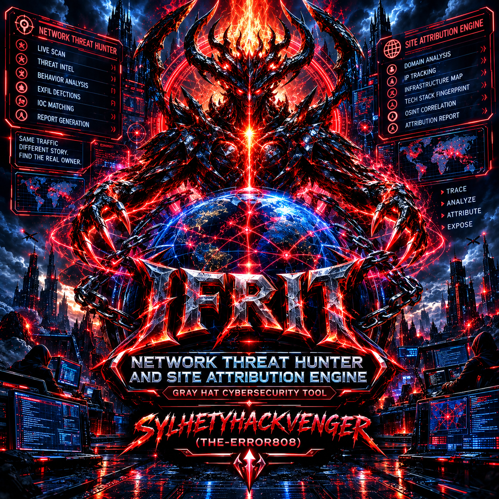

# IFRITH — Network Monitor & Site Attribution Engine
<p align="center">
  
</p>

⚠️ Legal & Ethical Notice — READ FIRST

IFRITH is a gray-hat tool. It ships offensive primitives (ARP poisoning, rogue DHCP, RA/NDP injection, TLS interception, DNS forgery) wrapped inside a defensive environment. That duality is intentional — but it comes with a hard rule:

Run IFRITH only on networks you own, operate, or have explicit written permission to test.

Unauthorized interception of network traffic is a criminal offense in virtually every jurisdiction (CFAA, Computer Misuse Act, GDPR, IT Act 2000, PECA, etc.). The author provides this tool for research, red-team engagement, network forensics, and Wi-Fi hygiene auditing on your own LAN. You are the sole party responsible for how you deploy it.

IFRITH is designed to stay on your LAN, stay under law, and never be a drop-in tool for attacking strangers.


# Description
IFRITH is a single-file Python 3 network monitor and site-attribution engine that runs on a Linux host acting as a Wi-Fi client (or on a monitor-mode-capable interface). It combines deep packet inspection, passive fingerprinting, active MITM primitives, and a live Textual dashboard into one coherent instrument. Unlike a packet sniffer that shows you raw bytes, IFRITH's core thesis is attribution: answering the question "which device on my network is talking to which app, service, or website, right now, and how?"

The engine passively observes your interface using AF_PACKET raw sockets, parses Ethernet/ARP/IP/IPv6/TCP/UDP/QUIC/HTTP2/TLS with dpkt, and enriches every flow with vendor OUI lookup, DHCP fingerprinting, JA3/JA4/JA4S/JA4H/JA4X/JA4SSH fingerprinting (both pure-Python and tshark-backed), DNS + mDNS + SSDP + NTP correlation, SNI extraction with TCP-fragment reassembly, and a domain→app knowledge graph covering 800+ applications across social, streaming, gaming, productivity, AI, cloud, VPN, and IoT categories.

On top of this visibility layer, IFRITH implements an optional full-duplex ARP-spoofing MITM that poisons every LAN device against the gateway, turns on kernel IP forwarding, installs NAT REDIRECT rules, and terminates HTTP/HTTPS through a transparent intercepting proxy that mints per-SNI leaf certificates from a local lab CA. It also stands up rogue DHCPv4/v6, RA, NDP, and SMB-message servers, offering exhaustive control over the LAN — always gated behind explicit user confirmation. A rich-based full-screen UI with ~90 live panels surfaces every layer of the capture: DNS events, MITM flows, JA4 fingerprints, tokens, cookies, JWTs, OAuth codes, forms, credentials, behavioral timing, cross-app correlation, QUIC connection-ID migrations, ECH downgrades, DNSBL hits, and more. The result is a research-grade LAN microscope that is simultaneously a red-team LAN chaos suite — and the entire file is one auditable Python program.

---
# Capabilities

2.1 Passive Network Visibility

· Raw capture via AF_PACKET with a configurable in-memory ring buffer and rotating PCAPs.
· Protocol coverage: Ethernet, ARP, IPv4, IPv6, TCP, UDP, ICMPv6, DHCPv4/v6, DNS, mDNS, SSDP, NTP, TLS, QUIC, HTTP/1.x, HTTP/2, WebSocket, SMB, RADIUS-adjacent signalling.
· Device discovery: arp-scan, nmap -sn, /proc/net/arp, plus reverse-DNS hostname resolution.
· OUI vendor attribution from master_oui.txt (100k+ prefixes) for every MAC seen.

2.2 Deep Fingerprinting

Family What IFRITH produces
JA3 / JA3S Client and server TLS fingerprints with ja3_database.csv labels
JA4 / JA4S Modern prefix_b_c client/server fingerprints
JA4H HTTP/1.1 and HTTP/2 request fingerprints
JA4X X.509 certificate chain fingerprints
JA4SSH SSH client/server fingerprints
DHCP Option-55 parameter-request-list fingerprint (dhcp_fingerprints.conf)
User-Agent Browser vs bot classifier with user-agents.json
TCP stack TTL / window-size / ISN behavior heuristics
Behavioral timing Inter-request interval and jitter per device

2.3 Attribution & Correlation

· Domain→App graph with 800+ services (Instagram, WhatsApp, Netflix, Steam, GitHub, OpenAI, Binance, PUBG, Temu, JioSaavn, etc.).
· Per-device app voting with exponential decay so the "top app" tracks current activity.
· Cross-device correlation on shared tokens, JWT sub claims, OAuth state, and JA3 hashes.
· Cross-app correlation on refresh-token reuse and cookie scopes.
· Behavioral baselining — flags new SNIs and JA3s that break a device's established pattern.
· DNSBL — 1000+ sensitive-domain whitelist (dnsbl_whitelist.txt) matched on DNS, SNI, and mDNS.
· Intent classification — labels sessions as real-time comm, publishing, maintenance, consumption, social, recreation, background, administration, IoT.

2.4 Active LAN Control (opt-in)

· Full-duplex ARP MITM with Kalman-scheduled poisoning, jitter, and automatic re-discovery every 17s.
· Rogue DHCPv4 (OFFER/ACK with configurable pool) and DHCPv6 (IA_NA).
· Rogue RA (RDNSS + PREF64 + prefix) and NDP NS/NA.
· SMB message sender/receiver on UDP/138.
· mDNS rename via forged mDNS PTR/TXT responses.
· NUD pinning (ip neigh … nud permanent) to hold poisoned ARP entries.

2.5 Interception & Injection

· Transparent HTTP/HTTPS proxy on :8880 / :8443 with SO_ORIGINAL_DST recovery and NAT REDIRECT rules for :80 and :443.
· Per-SNI leaf certificate minting from a local lab CA (ifrith_output/ca/ca.crt).
· Certificate-pinning detection — logs SNIs that reject the CA and stops retrying them.
· QUIC block (UDP/443 DROP) to force TCP TLS that the proxy can decrypt.
· DoH/DoT block against 80+ known public resolver IPs.
· HTTP replay engine — re-issue captured requests to a chosen target.
· WebSocket frame parsing, injection, and control-frame inspection.
· H2 HPACK static-table decoding, PUSH_PROMISE abuse detection.
· QUIC Initial/Retry parsing, connection-ID migration tracking, retry-token correlation.
· ECH downgrade detection and outer-SNI mapping.
· SNI defragmentation across TCP segments.

2.6 Credential & Token Intelligence

· HTTP form parsing (urlencoded, chunked, gzip/deflate/brotli).
· Basic auth, Bearer, X-API-Key, X-CSRF-Token extraction.
· Cookie jar with request/response direction tracking.
· JWT decode (header, payload, signature) with sub correlation.
· OAuth code/state capture.
· CSRF token scraping from HTML inputs and meta tags.
· Protocol credential parsers for FTP, POP3, IMAP, SMTP, Telnet.
· Regex credential sniffer for passwords, API keys, secrets, tokens in any payload.
· Token harvester for GitHub, Slack, Google API, OpenAI, and generic bearer tokens.

2.7 Operational & Forensic

· Live dashboard — ~90 panels, cached, keyboard-scrollable, TTY-safe.
· SQLite persistence — 20 tables covering devices, DNS, flows, JA3/JA4, tokens, creds, cookies, JWTs, OAuth, CSRF, HTTP, events, DNSBL, MITM flows.
· Signed append-only event log with SHA-256 hash chaining (ifrith_log.jsonl).
· UNIX control socket for scripted queries (stats, devices, replay, smbmsg, sql).
· UNIX mirror socket for streaming events to external consumers.
· In-memory SQL engine — run SELECT … across live state and exit.
· Kernel snapshot + restore — saves ip_forward, rp_filter, iptables-save, ARP cache; restores them on exit.
· PCAP rotation at configurable MB thresholds.
· Module registry with optional OpenSSL signature verification for plugin .py files.
· JSON export of the entire session (ifrith_export.json).

---

3. Advantages

1. Single-file deployment. No daemons, no orchestrator, no Docker. Copy ifrith.py to a Linux box, pip install dpkt rich, run as root. That's the entire install.
2. Attribution-first design. Every other sniffer shows you packets. IFRITH shows you who is using what app, with confidence scores, decayed per-device votes, and a knowledge graph of 800+ services.
3. Modern fingerprint suite. JA3 alone is obsolete. IFRITH ships JA4, JA4S, JA4H, JA4X, and JA4SSH — including a pure-Python path so it works without tshark.
4. Defensive + offensive in one. The same ARP table, OUI map, and device inventory that powers MITM also powers pure-passive LAN auditing. Flip MITM off and it is a legitimate Wi-Fi hygiene scanner.
5. Transparent about limits. Certificate-pinning breaks are logged loudly (MITM_PINS panel), not silently hidden. QUIC is blocked explicitly, not covertly. Every offensive action is preceded by a Confirm.ask.
6. Reversible. Kernel snapshot + restore, atexit handlers, SIGINT/SIGTERM/SIGHUP traps, full iptables teardown, ARP cache re-poisoning with the real gateway MAC on exit.
7. Auditable. One Python file. Every primitive is readable. A defender can grep for _poison, _install_nat, _mint_leaf, subprocess, iptables, and see exactly what it does.
8. Rich knowledge base. 800+ app domains, 100+ mDNS services, 80+ public resolvers, 100+ port services, curated DNSBL whitelist, DHCP fingerprint library, User-Agent browser/bot database.
9. Extensible. Modules directory, rule engine, policy profiles, control socket, mirror socket, SQL interface — every integration point is exposed.
10. Beautiful UI. rich Live layout with ~90 panels, cached rendering, TTY reflow, colored roles (YOU, ROUTER, DEV, MCAST, DNS), age/rate humanization, and a proper splash screen.

---

4. Nature of the Tool

IFRITH is a dual-use gray-hat instrument. It does not pretend to be neutral. Specifically:

· It actively modifies network state: ARP caches, DHCP leases, IPv6 router advertisements, iptables NAT rules, ip_forward, rp_filter, and (optionally) neighbor entries.
· It actively impersonates the gateway, the DHCP server, the IPv6 router, mDNS responders, and any TLS server whose SNI it decides to intercept.
· It actively terminates TLS for victims that trust its CA, decrypting HTTPS end-to-end.
· It actively captures credentials, tokens, cookies, JWTs, OAuth codes, and CSRF tokens from cleartext HTTP and from decrypted HTTPS.
· It actively forges DNS responses, mDNS records, SMB messages, and RA/NDP packets.

There is no "passive-only by default" safety net — the tool presents you with a menu and asks you to choose. Mode A disables MITM and proxy; modes B, C, and N progressively enable offensive primitives. The user, not the tool, is the responsible party.

IFRITH is therefore best understood as: a LAN red-team suite that happens to also be an excellent LAN blue-team dashboard. Both roles share the same code path, the same knowledge base, and the same UI.

---

5. Facts

Fact Detail
Language Python 3 (single file)
Runtime deps dpkt, rich
Optional deps tshark (deeper JA4), openssl (CA + module verify), iptables (NAT), arp-scan, nmap, nmcli, wpa_cli, iw, iwlist
Root required Yes (raw sockets + iptables)
Target OS Linux (uses /proc, AF_PACKET, sysctl, ip)
MAC support Not officially (no utun, no en0)
Windows support No
Default interface wlan0
Default gateway discovery ip route show default dev <iface>
Default CA directory ifrith_output/ca/
Default DB ifrith_output/ifrith.db (20 tables)
Default PCAP ifrith_output/ifrith_capture.pcap + rotated ifrith_NNNNN.pcap
Default signed log ifrith_output/ifrith_log.jsonl (SHA-256 chained)
Default control socket ifrith_output/ifrith.sock
Default mirror socket ifrith_output/ifrith_mirror.sock
Default HTTP proxy port 8880
Default HTTPS proxy port 8443
Default portal port 8890
Default ring size 50 000 frames
Default PCAP rotation 100 MB
Default MITM burst 0.4 s interval for 10 s, then 2.0 s steady
Default MITM rescan Every 17 s
Panels ~90 in ROWS_ORDER
Known apps 800+ domains in DOMAIN_TO_APP
Known mDNS services 200+ in MDNS_SERVICES
Known JA4 templates 22 in JA4_KNOWN
Known public resolvers 80+ in RESOLVER_IPS, DOH_RESOLVER_IPS, DOT_RESOLVER_IPS
Known port services 100+ in PORT_SERVICES
DNSBL default size 1000+ sensitive domains
Exit paths q, Ctrl+X, SIGINT, SIGTERM, SIGHUP, atexit
Shutdown actions Stop engines, close DB, write export JSON, dump PCAP, unlink sockets, restore kernel, re-ARP gateway

---

6. Responsibility

Running IFRITH means you accept all of the following:

1. Authorization. You will only run it on networks you own or have written permission to test. You will not point it at a café, airport, hotel, school, or corporate LAN you do not control.
2. Data handling. Credentials, tokens, cookies, JWTs, and OAuth codes captured by IFRITH are other people's secrets. You will store them lawfully, delete them when the engagement ends, and never use them for unauthorized access.
3. Notification. If you enable MITM on a shared LAN, you will notify the users. Silent interception of unaware users is not "research" — it is a crime.
4. Certificate authority. The CA key in ifrith_output/ca/ca.key is a weapon. Anyone with it can impersonate any TLS site to any device that trusts it. You will protect it, not distribute it, and revoke it when done.
5. Kernel state. IFRITH modifies ip_forward, rp_filter, iptables, ARP caches, and neighbor entries. You will verify restoration on exit (the KERNEL_SNAP panel and panel_kernel show state).
6. Reporting. Findings from IFRITH on a client network will be reported to the client — not used against them.
7. No redistribution of victims' data. Exported JSON, PCAPs, DBs, and signed logs are evidence. You will not publish them.
8. Jurisdiction. You will learn your local computer-misuse statutes before you run IFRITH. Ignorance is not a defense.

The author, SYLHETYHACKVENGER (THE-ERROR808), provides IFRITH as a research and education artifact. The author assumes no liability for misuse, damage, legal action, or data loss arising from its use. By running IFRITH you accept full responsibility for every packet it emits, every certificate it mints, every ARP reply it sends, and every byte it captures.

---

7. Quick Start

```bash
# 1. Install dependencies
pip install dpkt rich

# 2. Optional: better JA4 (needs tshark)
sudo apt install tshark arp-scan nmap iw wireless-tools

# 3. Run on your own Wi-Fi (root required)
sudo python3 ifrith.py -i wlan0

# 4. Passive-only audit (no MITM, no proxy, no kernel changes)
sudo python3 ifrith.py -i wlan0 --no-mitm --no-proxy

# 5. Scan-only (list APs and exit)
sudo python3 ifrith.py -i wlan0 --scan-only

# 6. Run SQL over live state and exit
sudo python3 ifrith.py -i wlan0 --sql "SELECT ip,mac,vendor FROM devices ORDER BY down DESC LIMIT 10"
```

Key Bindings

Key Action
↑ / k Scroll up one panel
↓ / j Scroll down one panel
PgUp / K Scroll up a page
PgDn / J Scroll down a page
g / Home Jump to top
G / End Jump to bottom
q / Ctrl+X Clean exit

Control Socket

```bash
echo "stats" | nc -U ifrith_output/ifrith.sock
echo "devices" | nc -U ifrith_output/ifrith.sock
echo "replay 3 192.168.1.50" | nc -U ifrith_output/ifrith.sock
echo "smbmsg 192.168.1.42 hello" | nc -U ifrith_output/ifrith.sock
echo "sql SELECT * FROM dnsbl LIMIT 20" | nc -U ifrith_output/ifrith.sock
```

---

8. Data Files (optional, in script_dir)

File Purpose
master_oui.txt MAC prefix → vendor map
dhcp_fingerprints.conf Option-55 → OS label map
ja3_database.csv JA3 hash → label, category
user-agents.json Known browser UA strings
dnsbl_whitelist.txt Sensitive domains to flag

If absent, IFRITH still runs — it just has less to enrich with.

---

9. Outputs

Path Contents
ifrith_output/ifrith.db SQLite: 20 tables, full session state
ifrith_output/ifrith_export.json JSON snapshot: DNS, JA3/JA4, tokens, creds, cookies, JWTs, OAuth, HTTP, alerts, events, DNSBL, MITM
ifrith_output/ifrith_capture.pcap Ring-buffer PCAP dump on exit
ifrith_output/ifrith_NNNNN.pcap Rotated PCAPs (100 MB each)
ifrith_output/ifrith_log.jsonl Signed, hash-chained event log
ifrith_output/ca/ca.crt Lab CA certificate (install on victims to enable HTTPS decryption)
ifrith_output/ca/ca.key Lab CA private key — protect this
ifrith_output/ifrith.sock UNIX control socket
ifrith_output/ifrith_mirror.sock UNIX event mirror socket
ifrith_output/modules/ Optional signed plugin modules

---

10. Final Word

IFRITH is not a toy and it is not a weapon — it is a responsibility. It grants you a level of LAN omniscience that most people never see, and it hands you offensive primitives that most people should never touch. Use it on your own network. Use it to audit your own Wi-Fi. Use it in authorized red-team engagements with signed scope documents. Use it to teach. Use it to defend. Do not use it on strangers.

"With great packet visibility comes great legal liability."
Type: Gray-Hat Network Analysis Instrument
License: For authorized, defensive, educational use only
AUTHOR: SYLHETYHACKVENGER (THE-ERROR808)

---

IFRITH is released for educational, defensive, and authorized red-team research. The author disclaims all liability for misuse. If you are unsure whether you are authorized to run this on a network, you are not.
